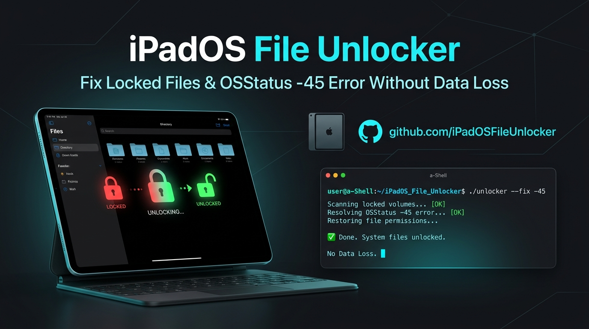

<p align="center">
  
</p>

# iOS / iPadOS File Unlocker

A small workaround for **locked files that cannot be deleted or restored in the Files app**, including files stuck in **Recently Deleted / Apagados** with errors such as **OSStatus -45**.

Designed for **iPhone and iPad** using [a-Shell](https://github.com/holzschu/a-shell).

> **Safety:** this project does **not delete files**. It only removes file-lock flags and restores owner read/write permissions. Deletion or restoration is still done manually in Apple's Files app.

> **Keywords / SEO**: iOS locked files, iPadOS OSStatus -45, cannot delete files in Files app, Files app stuck recently deleted, chflags uchg fix iOS, a-Shell file permissions repair, fix error -45 iPad, apagar arquivos bloqueados iPad.

## What this fixes

This workaround is useful when a file is visible in Files but:

- cannot be permanently deleted;
- cannot be restored from Recently Deleted;
- causes `OSStatus -45`;
- came from a camera/SD card as a protected or read-only file;
- stays locked even after the original card has been formatted.

The core repair commands are:

```sh
chflags -R nouchg .
chmod -R u+rwX .
```

They remove the user immutable/locked flag and restore owner read/write permissions recursively.

---

## Quick manual fix

Use this first if you only need to fix the problem once.

1. Install and open **a-Shell**.
2. Run:

```sh
pickFolder
```

3. In the picker, select the root **On My iPhone / On My iPad**.
4. If you are fixing Recently Deleted, enter the hidden trash folder:

```sh
cd .Trash
```

5. Unlock everything inside it:

```sh
chflags -R nouchg .
chmod -R u+rwX .
```

6. Return to **Files → Recently Deleted** and delete or restore the files normally.

### Unlock a normal folder

Run `pickFolder`, select the affected folder, then:

```sh
chflags -R nouchg .
chmod -R u+rwX .
```

No delete command is used.

---

## Reusable script

If the problem happens repeatedly, use `ipados-file-unlocker.sh`.

The script provides:

- **Unlock Trash**
- **Select folder to unlock**
- **Português (PT-BR) / English**
- persistent language preference
- confirmation before changing a selected folder
- no `rm`, `rmdir`, `unlink` or other delete command

### Quick install from a-Shell

From the a-Shell Documents folder:

```sh
curl -L https://raw.githubusercontent.com/Despensativo/ipados-file-unlocker/main/ipados-file-unlocker.sh -o ipados-file-unlocker.sh
sh ipados-file-unlocker.sh
```

### Recommended setup

Keep the script inside the **a-Shell Documents folder** so a-Shell can always access it.

Run:

```sh
sh ipados-file-unlocker.sh
```

On first launch, choose PT-BR or English. The choice is saved and can later be changed from the main menu.

### a-Shell `pickFolder` note

Some a-Shell builds have a known `pickFolder` behavior where the selected directory is bookmarked but the current directory does not immediately change when `pickFolder` is called from inside a script.

If the script cannot access `.Trash`:

```sh
pickFolder
```

Select **On My iPhone / On My iPad**, then run the script again:

```sh
sh ipados-file-unlocker.sh
```

a-Shell bookmarks folders selected with `pickFolder`, so later runs may be able to reuse that authorization.

---

## Why this can happen

A protected file from a camera or external storage can arrive on iOS/iPadOS carrying a locked/read-only state.

Apple's `OSStatus -45` corresponds to a locked-file condition. In some cases Files can move the item into Recently Deleted, but then fails to restore or permanently delete it.

This workaround removes the lock and restores write permission; **Files itself remains responsible for deleting/restoring the item**.

---

## Compatibility

- iPhone — iOS
- iPad — iPadOS
- a-Shell
- Files / On My iPhone / On My iPad

The workaround was developed from a real iPadOS 27 case. The same File Provider + a-Shell mechanism is available on iPhone as well.

---

# Português (PT-BR)

Este projeto é uma solução simples para **arquivos bloqueados que não podem ser apagados ou restaurados no app Arquivos**, inclusive itens presos em **Apagados** com erros como **OSStatus -45**.

Funciona com **iPhone e iPad** usando o [a-Shell](https://github.com/holzschu/a-shell).

> **Segurança:** o script **não apaga nenhum arquivo**. Ele apenas remove flags de bloqueio e restaura permissões de leitura/escrita. Depois disso, você apaga ou restaura normalmente pelo app Arquivos.

## Solução manual rápida

No a-Shell:

```sh
pickFolder
```

Selecione a raiz **No Meu iPhone / No Meu iPad**.

Para reparar a lixeira:

```sh
cd .Trash
chflags -R nouchg .
chmod -R u+rwX .
```

Depois volte para:

**Arquivos → Apagados**

e tente apagar ou restaurar normalmente.

Para uma pasta comum, use `pickFolder`, selecione a pasta problemática e execute apenas:

```sh
chflags -R nouchg .
chmod -R u+rwX .
```

## Para quem precisa repetir a correção

Você pode baixar direto pelo a-Shell:

```sh
curl -L https://raw.githubusercontent.com/Despensativo/ipados-file-unlocker/main/ipados-file-unlocker.sh -o ipados-file-unlocker.sh
sh ipados-file-unlocker.sh
```

Ou, se o arquivo já estiver salvo:

```sh
sh ipados-file-unlocker.sh
```

O menu possui:

```text
[1] Desbloquear Lixeira
[2] Selecionar pasta para desbloquear
[3] Alterar idioma
[0] Sair
```

O idioma escolhido fica salvo. O script não contém comandos de exclusão.

## Importante

Trabalhe preferencialmente dentro de **No Meu iPhone / No Meu iPad** e confira a pasta selecionada antes de confirmar alterações recursivas.

---

## Disclaimer

Use at your own risk. Permission and flag changes are recursive inside the selected folder. Always verify the selected location before confirming.

## License

MIT
